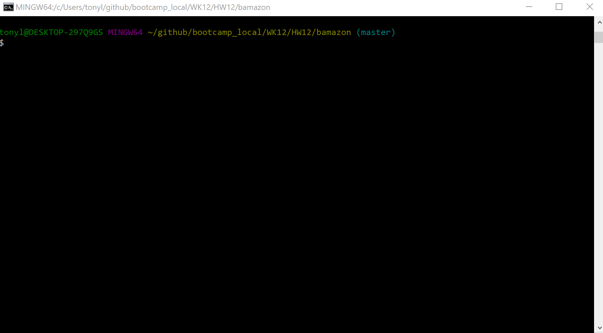

# bamazon
This project is a simulation of an online storefront (like Amazon) with a command line interface (CLI).  The app consists of three clients that allow different operations based on the role of the user (see descriptions below).
1. Customer Client - Allows the user to select a product to purchase and remove the item from inventory.
1. Manager Client - Allows the user to view the inventory and add additional inventory.
1. Supervisor Client - Allows the user to view the highest grossing departements and track product sales across departments.
# Demo
 
# Setup
In order to run the app, you will need to clone this repository and install all required technologies listed below.
# Required Technologies
1. [Node.js LTS](https://nodejs.org/en/) 
2. [NPM](https://www.npmjs.com/get-npm) 
3. [Git & Git Bash](https://git-scm.com/downloads) 
4. [MySQL 5.7.24](https://dev.mysql.com/downloads/installer/) 
# NPM Modules Used
1. CLI-Table
2. Console.Table
3. MySQL
4. Inquirer
# Installation Steps
1. Open Bash and Clone the bamazon repo
2. Install all required technologies
3. In Bash, change the current directory to the bamazon directory and install all modules from the package.json, using the following command:
    1. npm i [Enter]  
4. Install MySQL Database Server on your machine
    1. Create MySQL login id and password
5. In Bash, type the following command in the bamazon directory to create the bamazon database:
    1. mysql -u root -p < initDB.sql
    2. type your MySQL password [ENTER]
# Execute Program
1. In Bash, enter one of the following commands in the bamazon directory, to start the corresponding client.
    1. Customer CLI Client: node bamazonCustomer.js [ENTER]
    2. Manager CLI Client: node bamazonManager.js [ENTER]
    3. Supervisor CLI Client: node bamazonSupervisor.js [ENTER]
# Use
This repo is available for public non-commercial use only.
# Goal
The goal of this project was to create an online storefront, to interact with a MySQL database, via a command line interface.  